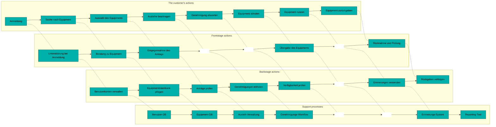

```mermaid
graph LR

    subgraph Support processes
        D1[Benutzer-DB] --> D2[Equipment-DB] --> D3[Ausleih-Verwaltung] --> D4[Genehmigungs-Workflow] --> D5[" "] --> D6[" "] --> D7[Erinnerungs-System] --> D8[Reporting-Tool]
    end

    subgraph Backstage actions
        C1[Benutzerkonten verwalten] --> C2[Equipmentdatenbank pflegen] --> C3[Anträge prüfen] --> C4[Genehmigungen einholen] --> C5[Verfügbarkeit prüfen] --> C6[" "] --> C7[Erinnerungen versenden] --> C8[Rückgaben verfolgen]
    end

    subgraph Frontstage actions
        B1[Unterstützung bei Anmeldung] --> B2[Beratung zu Equipment] --> B3[Entgegennahme des Antrags] --> B4[" "] --> B5[" "] --> B6[Übergabe des Equipments] --> B7[" "] --> B8[Rücknahme und Prüfung]
    end

    subgraph The customer's actions
        A1[Anmeldung] --> A2[Suche nach Equipment] --> A3[Auswahl des Equipments] --> A4[Ausleihe beantragen] --> A5[Genehmigung abwarten] --> A6[Equipment abholen] --> A7[Equipment nutzen] --> A8[Equipment zurückgeben]
    end

    A1 -.- B1 -.- C1 -.- D1
    A2 -.- B2 -.- C2 -.- D2
    A3 -.- B3 -.- C3 -.- D3
    A4 -.- B4 -.- C4 -.- D4
    A5 -.- B5 -.- C5 -.- D5
    A6 -.- B6 -.- C6 -.- D6
    A7 -.- B7 -.- C7 -.- D7
    A8 -.- B8 -.- C8

    classDef default fill:#00b1ab,stroke:#333,stroke-width:1px,color:#000;
    classDef invisible fill:#ffffff,stroke:#ffffff,color:#000;
    class D5,D6,B4,B5,B7,C6 invisible;


```