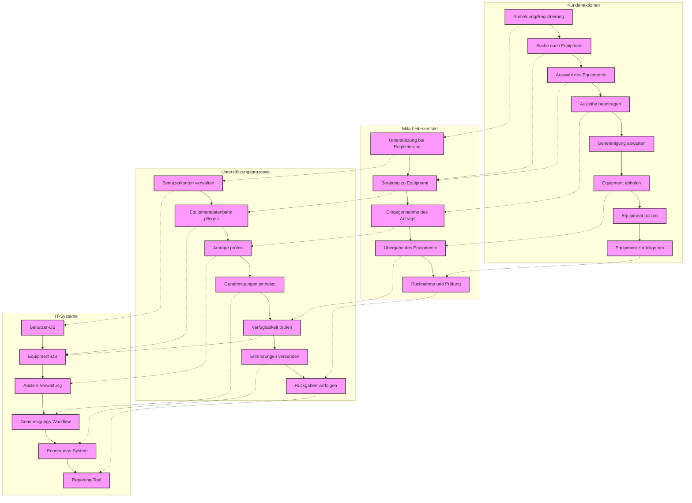

```mermaid
graph TD
    subgraph Kundenaktionen
        A1[Anmeldung/Registrierung] --> A2[Suche nach Equipment]
        A2 --> A3[Auswahl des Equipments]
        A3 --> A4[Ausleihe beantragen]
        A4 --> A5[Genehmigung abwarten]
        A5 --> A6[Equipment abholen]
        A6 --> A7[Equipment nutzen]
        A7 --> A8[Equipment zurückgeben]
    end

    subgraph Mitarbeiterkontakt
        B1[Unterstützung bei Registrierung] --> B2[Beratung zu Equipment]
        B2 --> B3[Entgegennahme des Antrags]
        B3 --> B4[Übergabe des Equipments]
        B4 --> B5[Rücknahme und Prüfung]
    end

    subgraph Unterstützungsprozesse
        C1[Benutzerkonten verwalten] --> C2[Equipmentdatenbank pflegen]
        C2 --> C3[Anträge prüfen]
        C3 --> C4[Genehmigungen einholen]
        C4 --> C5[Verfügbarkeit prüfen]
        C5 --> C6[Erinnerungen versenden]
        C6 --> C7[Rückgaben verfolgen]
    end

    subgraph IT-Systeme
        D1[Benutzer-DB] --> D2[Equipment-DB]
        D2 --> D3[Ausleih-Verwaltung]
        D3 --> D4[Genehmigungs-Workflow]
        D4 --> D5[Erinnerungs-System]
        D5 --> D6[Reporting-Tool]
    end

    %% Verbindungen zwischen den Ebenen
    A1 -.-> B1
    A2 -.-> B2
    A3 -.-> B2
    A4 -.-> B3
    A6 -.-> B4
    A8 -.-> B5

    B1 -.-> C1
    B2 -.-> C2
    B3 -.-> C3
    B4 -.-> C5
    B5 -.-> C7

    C1 -.-> D1
    C2 -.-> D2
    C3 -.-> D3
    C4 -.-> D4
    C5 -.-> D2
    C6 -.-> D5
    C7 -.-> D6

    %% Legende
    classDef defaultStyle fill:#f9f,stroke:#333,stroke-width:2px;
    class A1,A2,A3,A4,A5,A6,A7,A8 defaultStyle;
    class B1,B2,B3,B4,B5 defaultStyle;
    class C1,C2,C3,C4,C5,C6,C7 defaultStyle;
    class D1,D2,D3,D4,D5,D6 defaultStyle;


```