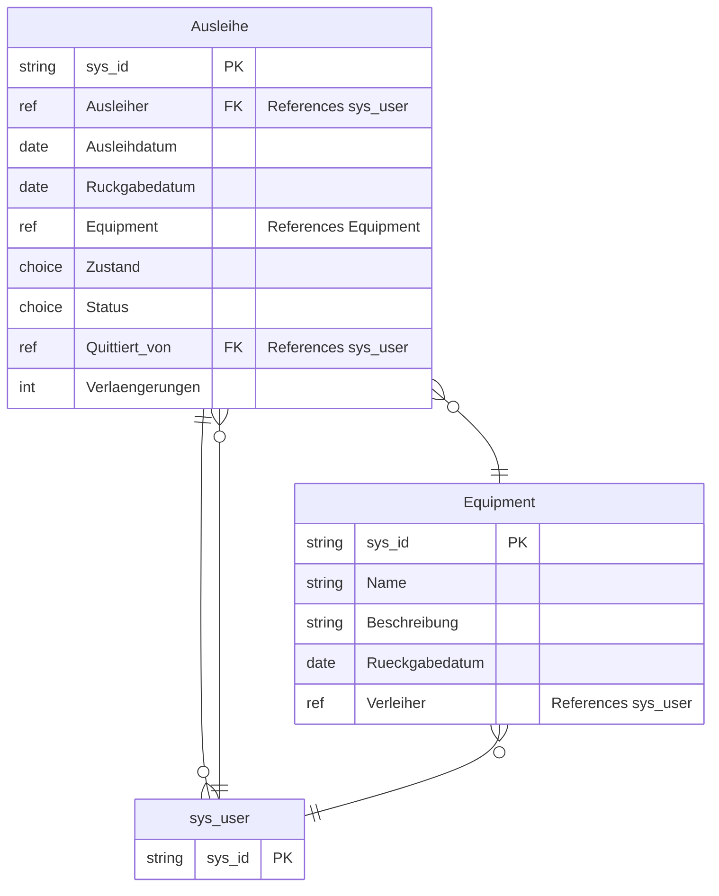

```mermaid
erDiagram
    Ausleihe {
        string sys_id PK
        ref Ausleiher FK "References sys_user"
        date Ausleihdatum
        date Ruckgabedatum
        ref Equipment "References Equipment"
        choice Zustand
        choice Status
        ref Quittiert_von FK "References sys_user"
        int Verlaengerungen

    }

    Equipment {
        string sys_id PK
        string Name
        string Beschreibung
        date Rueckgabedatum
        ref Verleiher "References sys_user"
    }

    sys_user {
        string sys_id PK
    }


    %% Relationships
    Ausleihe ||--o{ sys_user : ""
    Ausleihe }o--|| sys_user : ""
    Ausleihe }o--|| Equipment : ""
    Equipment }o--|| sys_user : ""
  

```