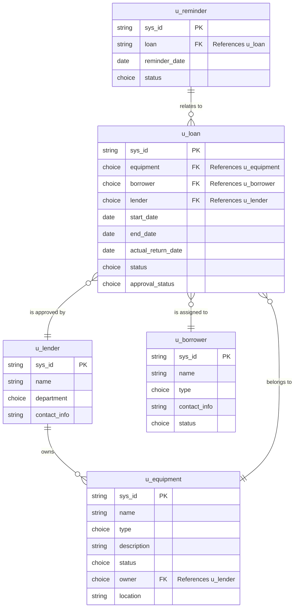

```mermaid
erDiagram
    u_equipment {
        string sys_id PK
        string name
        choice type
        string description
        choice status
        choice owner FK "References u_lender"
        string location
    }

    u_lender {
        string sys_id PK
        string name
        choice department
        string contact_info
    }

    u_borrower {
        string sys_id PK
        string name
        choice type
        string contact_info
        choice status
    }

    u_loan {
        string sys_id PK
        choice equipment FK "References u_equipment"
        choice borrower FK "References u_borrower"
        choice lender FK "References u_lender"
        date start_date
        date end_date
        date actual_return_date
        choice status
        choice approval_status
    }

    u_reminder {
        string sys_id PK
        string loan FK "References u_loan"
        date reminder_date
        choice status
    }

    %% Relationships
    u_lender ||--o{ u_equipment : "owns"
    u_loan }o--|| u_equipment : "belongs to"
    u_loan }o--|| u_borrower : "is assigned to"
    u_loan }o--|| u_lender : "is approved by"
    u_reminder ||--o{ u_loan : "relates to"


```